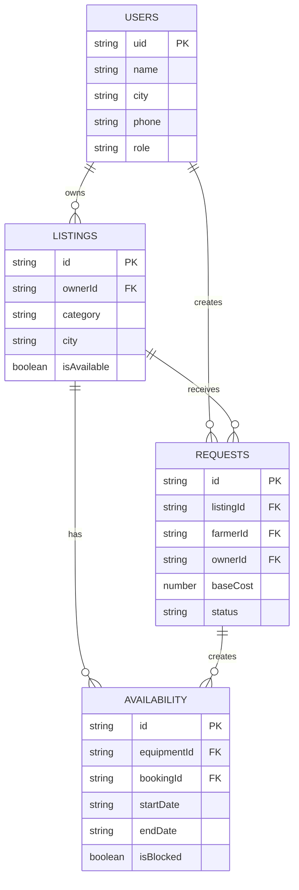

# 🌾 KrishiDhan — Firebase Firestore Database Schema

This document defines the complete production database schema, collections, validation constraints, and indexes for Cloud Firestore in the KrishiDhan Agricultural Equipment Rental & Sales Platform.

**Region:** asia-south1 (Mumbai)

---

## 1. Database Structure

```
Firestore Database (default)
│
├── users
│   └── {uid}
│       ├── uid: String
│       ├── name: String
│       ├── city: String
│       ├── phone: String
│       ├── photoURL: String
│       └── role: String
│
├── listings
│   └── {listingId}
│       ├── id: String
│       ├── ownerId: String
│       ├── category: String
│       ├── city: String
│       ├── description: String
│       ├── images: Array<String>
│       ├── isAvailable: Boolean
│       ├── lat: Number
│       ├── lng: Number
│       └── listingType: String
│
├── requests
│   └── {requestId}
│       ├── id: String
│       ├── listingId: String
│       ├── ownerId: String
│       ├── farmerId: String
│       ├── baseCost: Number
│       ├── bookingType: String / Null
│       ├── acresBooked: Number / Null
│       ├── daysBooked: Number / Null
│       ├── hoursBooked: Number / Null
│       ├── startDate: String / Null
│       ├── endDate: String / Null
│       ├── farmerMessage: String
│       ├── message: String
│       ├── status: String
│       └── createdAt: Timestamp
│
└── availability
    └── {availabilityId}
        ├── id: String
        ├── equipmentId: String
        ├── bookingId: String
        ├── startDate: String
        ├── endDate: String
        ├── isBlocked: Boolean
        ├── reason: String
        └── createdAt: Timestamp
```

---

## 2. Collection Schemas

### Collection: `users`
* **Path:** `/users/{uid}`
* **Document ID:** Firebase Auth UID

| Field | Data Type | Required | Example |
|:---|:---|:---:|:---|
| `uid` | String | Yes | `"farmer_rajesh_101"` |
| `name` | String | Yes | `"Shwet Kshirsagar"` |
| `city` | String | Yes | `"Karad"` |
| `phone` | String | Yes | `"7517021908"` |
| `photoURL` | String | No | `""` |
| `role` | String | Yes | `"farmer"` / `"owner"` |

---

### Collection: `listings`
* **Path:** `/listings/{listingId}`
* **Document ID:** Auto-generated (`listing_{timestamp}`)

| Field | Data Type | Required | Example |
|:---|:---|:---:|:---|
| `id` | String | Yes | `"listing_1790883205482"` |
| `ownerId` | String | Yes | `"farmer_rajesh_101"` |
| `category` | String | Yes | `"tractor"` |
| `city` | String | Yes | `"Kolhapur"` |
| `description` | String | Yes | `"45 HP Mahindra tractor, 2021 model"` |
| `images` | Array of Strings | Yes | `["https://res.cloudinary.com/..."]` |
| `isAvailable` | Boolean | Yes | `true` |
| `lat` | Number | Yes | `16.705` |
| `lng` | Number | Yes | `74.2433` |
| `listingType` | String | Yes | `"rent"` / `"sell"` |
| `createdAt` | Timestamp | Yes | `serverTimestamp()` |

---

### Collection: `requests`
* **Path:** `/requests/{requestId}`
* **Document ID:** Auto-generated (`req_{timestamp}`)

| Field | Data Type | Required | Example |
|:---|:---|:---:|:---|
| `id` | String | Yes | `"req_1790883205482"` |
| `listingId` | String | Yes | `"listing_tractor_101"` |
| `ownerId` | String | Yes | `"farmer_rajesh_101"` |
| `farmerId` | String | Yes | `"farmer_suresh_202"` |
| `baseCost` | Number | Yes | `380000` |
| `bookingType` | String / Null | If rent | `"day"` / `"hour"` / `"acre"` |
| `acresBooked` | Number / Null | If rent | `5` |
| `daysBooked` | Number / Null | If rent | `3` |
| `hoursBooked` | Number / Null | If rent | `8` |
| `startDate` | String / Null | If rent | `"2026-10-15"` |
| `endDate` | String / Null | If rent | `"2026-10-18"` |
| `farmerMessage` | String | No | `"Need for wheat harvest"` |
| `message` | String | No | `"Booking summary..."` |
| `status` | String | Yes | `"pending"` |
| `createdAt` | Timestamp | Yes | `serverTimestamp()` |

#### Status State Machine:
* **pending** → Initial state after buyer submits request
* **accepted** → Owner accepts request
* **rejected** → Owner declines request
* **completed** → Deal finalized & payment confirmed
* **cancelled** → Buyer cancels before approval

---

### Collection: `availability`
* **Path:** `/availability/{availabilityId}`
* Prevents double-booking overlapping dates for rental machinery.

| Field | Data Type | Required | Example |
|:---|:---|:---:|:---|
| `id` | String | Yes | `"avail_req_1790883205482"` |
| `equipmentId` | String | Yes | `"listing_tractor_101"` |
| `bookingId` | String | Yes | `"req_1790883205482"` |
| `startDate` | String | Yes | `"2026-10-15"` |
| `endDate` | String | Yes | `"2026-10-18"` |
| `isBlocked` | Boolean | Yes | `true` |
| `reason` | String | Yes | `"booking"` / `"manual"` |
| `createdAt` | Timestamp | Yes | `serverTimestamp()` |

---

## 3. Relationships



---

## 4. Firestore Security Rules

```javascript
rules_version = '2';
service cloud.firestore {
  match /databases/{database}/documents {

    match /users/{userId} {
      allow read: if true;
      allow create: if request.resource.data.uid is string
                    && request.resource.data.name is string
                    && request.resource.data.phone is string
                    && request.resource.data.city is string;
      allow update: if true;
      allow delete: if request.auth != null && request.auth.uid == userId;
    }

    match /listings/{listingId} {
      allow read: if true;
      allow create: if request.resource.data.ownerId is string;
      allow update, delete: if true;
    }

    match /requests/{requestId} {
      allow read: if true;
      allow create: if request.resource.data.listingId is string
                    && request.resource.data.ownerId is string;
      allow update, delete: if true;
    }

    match /availability/{availabilityId} {
      allow read: if true;
      allow create: if request.resource.data.equipmentId is string
                    && request.resource.data.isBlocked is bool;
      allow update, delete: if true;
    }
  }
}
```

---

## 5. Implementation Notes

* **Primary identifiers:** Use Firebase UID for users and Firestore document IDs for other collections.
* **Foreign keys:** Store related document IDs as strings, not duplicated documents.
* **Images:** Store Cloudinary URLs in the `images` array.
* **Dates:** Use consistent `YYYY-MM-DD` format for booking dates. Use Firestore `Timestamp` for `createdAt`.
* **Booking status:** `pending`, `accepted`, `rejected`, `completed`, `cancelled`.
* **Availability reason:** `booking` or `manual`.
* **Region:** asia-south1 (Mumbai).
* **Total:** 4 main collections (`users`, `listings`, `requests`, `availability`).
